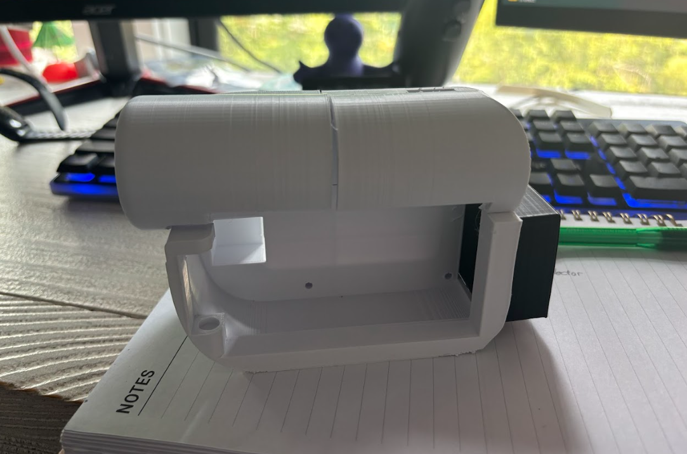

# Krill Kam Updates

Howdy wanna see the krill kam grow? 

Check out the updates below! :eyes::shrimp: [^1]
[^1]: I've spent 22.5 hours total on this project so far 😺

## May 16th: Sketching
Got in a rough idea of what I want the Camcorder to look like. It is based off the Sony Handy Cam that I have at home. 

> Time Spent (Sketching) ~ 1 hour

## May 17th: First CAD & Print
Today I was just creating the Basic CAD model for the camera. I plan on making a full CAD when I figure out what parts I'll use. I already have a screen and raspi 4 at home so I have some basic dimensions for that.  

> Time Spent (CAD and printing) ~ 2.5 hours

## May 18th: Updating CAD

Didn't do too much today, just focused on updating the CAD model based on how the first CAD printed. Found some issues with clearance and fitting the Raspi in the actual shell. I revamp the inside to have a notch for the raspi and enough room for wires, buttons, proto boards, etc. Anyways, I still need to work on the actual pull out screen part and battery compartment.  

> Time Spent (CAD) ~ 1 hour

## May 25th: Arm In CAD

Today I wanted to get the arm part with the hinge modeled in Fusion. This was my first time modeling a hinge and using the join feature in fusion. I went off a hinge design based on Maker's Muse's snap hinge in his video "Incredibly Handy 3D Printed Hinges!". I got the hinge to work with a bit of struggle at first, but overall I'm happy with the model. I plan on printing out the model one more time to figure out sizing, but the only thing left is to find where I'll put the power supply in the case.  

> Time Spent (CAD) ~ 3 hours

## May 30th: Battery holder in CAD + some shopping

I modeled a little case on the end of my camera to hold the batteries and some remodeling on the holes for buttons. I'm still not sure what battery type i'll be using but I'm leaning towards a Li-Po with 5v converter and battery charger PCB like the Adafruit PowerBoost 1000. For the shopping, I think I've decided on using the Waveshare 2in touch display module for my main screen and the 0.85 LCD display module for the view hole screen. I plan on writing some test scripts just to get the camera working, but I won't be able to test the displays until I get them.  
 

> Time Spent (CAD) ~ 1.5 hours

## June 4th: Battery holder in CAD + some shopping

Today I coded some more on the camera app script by adding in new features to allow button presses to turn on and off the preview. I also worked a bit on the CAD and finally decided on the screen I will use for the camera. I'm going with a 2.4" TFT display since it fits perfectly inside my arm.  
 

> Time Spent (CAD+Code) ~ 1 hour

## June 5th: V2 of model DONE!

The case is done! I modeled in a spot to place the USB flashdrive in. I plan on using a flash drive to store the photos. I also place in components such as the buttons on the top of the case (not in picture). Lastly, I added in some text and remodeled the arm/ screen holder to have points to drill in the screen. The STL files are available in the [case folder](Case/V2).  

Also make sure to check out the [video](Screenshots/KrillKamCaseV2.mp4) in the screenshots folder for a short overview of the camera model.  

> Time Spent (CAD) ~ 2.5 hours

## June 8th: Finished BOM

Today I began printing out the parts for krill kam case. I also finished the BOM of what items I need to buy. The total came to around $110 without shipping, but I'm sure with coupons and deals I will be able to get that price down. Also I settled on getting the battery off of Amazon even though it was pricey just because of shipping reasons. Anyways below is a photo of the pieces I have printed out so fall (arm, battery shell, and USB panel cover) more is printing now!   

> Time Spent (CAD) ~ 0.5 hours

## June 9th: Updated Hinge design

Today I printed out the base and notice 3 problems with clearances.  

1. I couldn't get the battery shell to fit in smoothly, so I added in some extra clearance to the hole on the back of the base.
2. The USB panel cover didn't fit in, so I added more clearances.
3. Lastly, the arm couldn't be attached to the base, so I got rid of the notch in the center and will print that part on its own and glue it back in.    

> Time Spent (CAD) ~ 0.5 hours

## June 11th: Printed case!

I fixed the problems with the base and reprinted the parts. I now have a full shell of the krill kam! I also did a bit of work on the gui code, but still working on layout stuff.  

> Time Spent ~ 1 hour

## June 12th: GUI with live camera feed

Today I got a background on my camera app, along with a live feed of the camera using OpenCV. I watched some of clear code's "The ultimate introduction to modern GUIs in Python [ with tkinter ]" to get the background image working and general knowledge on Tkinter. I also used Jake's Science Shop's "Adding a Webcam Stream to our Python - Tkinter Drone Controller | Part 2: GUI Video Stream" video to get OpenCV working with my app. Now I just need to fix the scaling issues with the camera and add in the rest of app features. I want a photo viewing mode, camera controls like zoom and focus, accurate time/date, and fun fish themed features! For now I've been using frutiger aero photos as my background, but I plan to shift into creating my own icons and backgrounds using pixel art!   

> Time Spent ~ 3 hours

## June 13th: Fixed camera feed and read me

I spent all of today trying to fix the camera feed so that the camera aspect ratio stays the same no matter the screen size. I got it to work using some ratio of camera height to width and comparing it with the window height and width. The code I learned yesterday when creating a background that resizes with app was what I based off today's code. I also added place holder buttons as well. Lastly I got my readme polished and I think I'm ready to submit for my grant. Hopefully I can get the screen part soon(it will help me a lot with creating the GUI).  

> Time Spent ~ 3 hours

## June 15th: new windows on GUI

Today I used the top level widget to create 2 new windows for the app. I now have a window for powering off the camera and a window to review photos. The window can't quite cycle through photos yet, but I am working on that at the moment. I think i'll try the same idea as I saw in geeks for geeks tutorial on creating a image viewer app with tkinter.    

> Time Spent ~ 2 hours